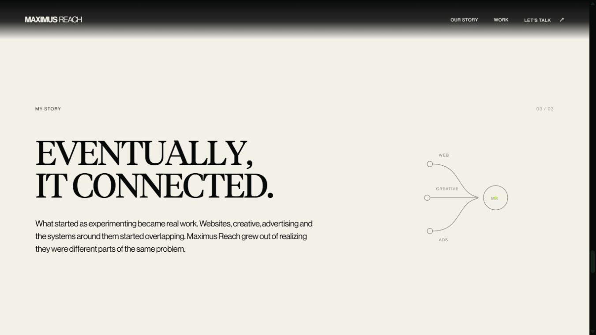
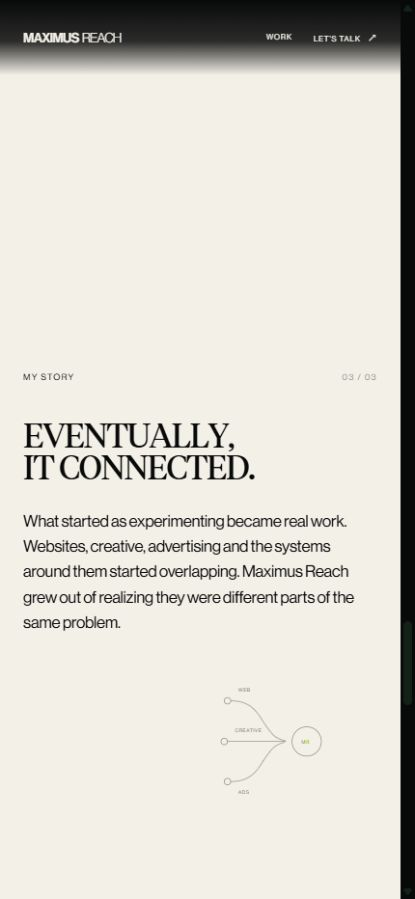

# About source-port pass, October 5, 2026

The About page now runs: approved opening, approved portrait, three cream Story beats, one short bridge, approved Web / Ads / Creative sequence. No checkpoint, CTA, crumple, parallax, service redesign, new dependency or second Lenis instance was created.

## 1. Files changed

All implementation files are under `src/components/about/`.

Modified:

- `AboutContinuation.tsx`: mounts the bridge, initializes source motion after the existing route reset, owns cleanup.
- `AboutStorySection.tsx`: identifies actual effect17/20/27 on the three existing lightweight editorial beats and original SVG studies.
- `aboutStoryContent.ts`: applies the supplied Story copy corrections.
- `aboutMotionConfig.ts`: removes the rejected custom Story configuration; service configuration is retained.
- `aboutReadingResize.ts`: includes the bridge and uses logical pinned spans to preserve reading position.
- `AboutDisciplines.tsx`: changes only the section number from 04 to 05.
- `about-continuation.css`: adds the short cream bridge layout; approved service styling is retained.
- `README.md`: documents this pass and marks prior Story mechanics as superseded.

Added:

- `aboutCodropsSet2Motion.ts`: source effect port and scoped SplitText lifecycle.
- `AboutStoryBridge.tsx`: DIFFERENT SKILLS. / SAME OBSESSION.
- `codrops-LICENSE.txt`: the original MIT license.

Deleted: `aboutStoryMotion.ts`, the rejected custom Story animation module.

Verification artifacts are in this directory: this report, `runtime-test.html` (development-only diagnostic fixture), `runtime-evidence.json`, `scope-check.json`, `desktop-story.png`, and `mobile-story.png`. The QA fixture is not mounted by the application or included as a production route.

## 2. Exact effects

- Story 01: effect17, original random character rotation and Z depth.
- Story 02: effect20, original baseline-origin character rotation.
- Story 03: effect27, original word X/Y/Z convergence and rotation.
- Bridge 04: effect28, original center-distance character scale/Y/rotation/filter math.
- Story paragraphs: effect16, original block rotation and staggered word opacity.

The mechanical baseline was the local original `C:/Users/hitso/Downloads/OnScrollTypographyAnimations-main/src/js/index2.js`, alongside its `index2.html` grouping and `base.css` layout. Demo branding/chrome/colors/packages were not imported.

## 3. Original source values preserved

All normal-motion effects use source `scrub: true` and the original GSAP default tween duration, explicitly .5 seconds. Stagger adds to each tween's total duration.

- effect17: each character's parent gets perspective 1000; rotateX random -120 to 120; Z random -200 to 200; opacity 0 to 1; ease `none`; stagger .02; `top bottom` to `bottom top`.
- effect20: perspective 1000; origin `50% 100%`; rotationX 90 to 0; opacity 0 to 1; ease `power4`; random stagger .03; `center bottom` to `bottom top+=20%`.
- effect27: each word's parent gets perspective 1000; Z random 500 to 950; X percent -100 to 100; Y percent -10 to 10; rotationX -90 to 90; opacity 0 to 1; final X/Y/Z/rotation zero; ease `expo`; random stagger .006; `center center` to `+=300%`, pinned.
- effect28: the exact original odd/even center-factor calculation and `mapRange` calls; scale .5 to 2.1, Y 0 to 60, left rotation -4 to 0 / right 0 to 4; origin `50% 100%`; filter `blur(12px) opacity(0)` to `blur(0px) opacity(1)`; ease `power2.inOut`; center stagger amount .15; each word from `top bottom+=40%` to `top top+=15%`; no pin. This is a brief character effect, not a whole-page filter or idle loop.
- effect16: paragraph origin `0% 50%`, rotation 3 to 0, ease `none`, `top bottom` to `top top`. Word opacity .1 to 1, stagger .05, `top bottom-=20%` to `center top+=20%`.

## 4. React/layout adaptations

Existing GSAP SplitText supplies the original `.word > .char` grouping and accessible unsplit headings instead of installing the demo's global Splitting dependency. Each effect remains a GSAP `fromTo`, with scoped selectors and contexts. Cleanup reverts animation/pins before restoring split DOM. There are no per-frame React updates or layout measurements.

Effect27 pins the complete Story article, the equivalent full scene container in this layout, to keep the paragraph and SVG with its heading. Its paragraph triggers identify that scene as `pinnedContainer`, correcting refresh offsets without changing source ranges. Resize preservation measures the logical pin spacer at refresh rather than the moving viewport box.

Mobile effect17/effect27 Z depth is 65% of source: effect17 +/-130, effect27 325 to 617.5. Perspective remains 1000. Mobile effect27 ends at `+=75%` rather than `+=300%`, retaining convergence without a long pin. At 393x852 this is 639px; at 430x932 it is 699px. Other effect ranges and stagger/easing remain source values.

Reduced motion keeps unsplit readable text, small opacity/Y settling for Story, a static bridge, and all three services in normal flow. It has no new continuation pins or character filters.

The original small SVG studies follow their headline's progress through paused timelines, without adding another animation clock. About initialization uses one cancellable setup frame after the app's existing route scroll reset. This resolves a return-to-About race that otherwise left the service Observer active while the page had already returned to the opening. Shared scroll-reset/provider code and the service engine were not edited.

## 5. Portrait untouched

Source/public/package SHA-256 comparison against the pre-edit hash list confirms zero changes outside the About component directory. Opening, portrait, card styling, beacon, artwork, page entry, shared source, unrelated routes and all public assets are byte-identical. No source backup/checkpoint was created. See `scope-check.json`.

## 6. Approved services intact

`aboutServiceSequence.ts`, its configuration, service visuals, wrapper markup and service CSS remain intact. Only the visible section number changes to 05. Verified Web -> Ads -> Creative, reverse transitions, two rapid wheel bursts advancing only one step, keyboard movement, forward/reverse pointer swipes and releases beyond Creative/above Web. Release resumes Lenis and disables interception. Existing replaceable `AboutServiceVisual` placeholder internals remain.

## 7. Rejected implementation removed

The old custom `aboutStoryMotion.ts` and Story-specific tuning were deleted. The three plain headline/paragraph/SVG structures are reused with the supplied copy and the actual Set 2 effects; the previous approximation mechanics are not mounted. No rejected biography master timeline, decorative buzzwords, cards, parallax or final CTA remains mounted.

## 8. Verification

- `npm run build` (`tsc -b && vite build`): passes. Existing Lottie eval and bundle-size warnings remain.
- Scoped ESLint of changed About TS/TSX modules: passes.
- Normal-motion checks: 1440x900, 1366x768, 393x852, 430x932, without horizontal overflow.
- Actual character transforms, perspective/origin, effect27 convergence and per-word bridge filters checked in rendered DOM.
- Mobile resize within effect27 retains approximately the same reading progress (.501 to .495).
- Route exit: zero continuation triggers, Observers, split wrappers or pins. Return: one complete set, service inactive, Lenis running, opening at Y=0.
- Reduced-motion 393x852: no split wrappers or pins; bridge filter `none`; all services visible in normal flow; Creative remains reachable.
- Built production page at 1440x900: correct order, desktop mode, two continuation pins, no horizontal overflow, no console errors; service entry and Escape release verified.

`runtime-evidence.json` records final measurements. These are browser checks, not physical phone/trackpad or frame-rate profiling.

## 9. Preview

[About development preview](http://localhost:5175/about). Build preview also verified at [localhost:4175/about](http://localhost:4175/about).

Stopped here for visual review.

