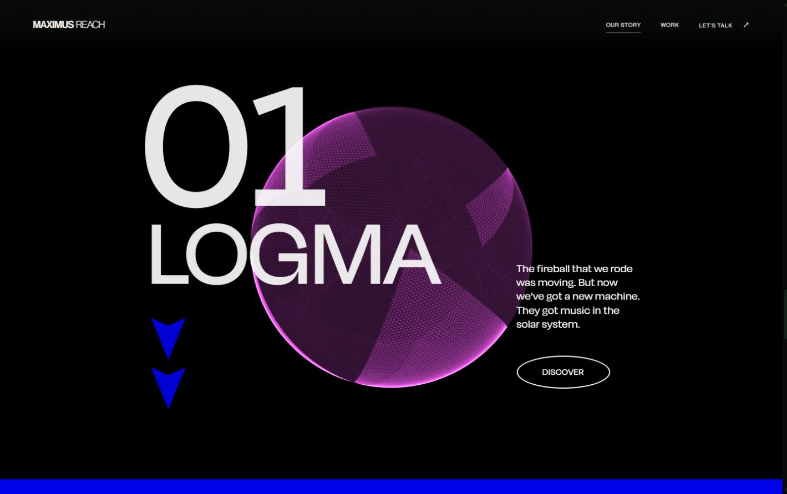
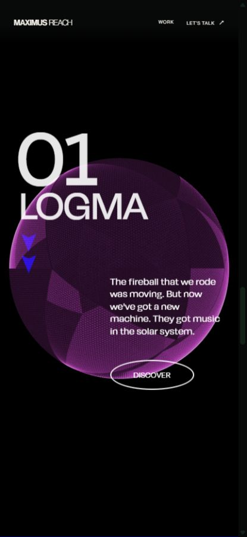

# About Shaders on Scroll experiment

The middle section now reproduces the original three-stage black/blue layout and WebGL object. Page order is unchanged opening, unchanged portrait, shader experiment, approved Web / Ads / Creative sequence. No CTA, crumple, Substance or further section was added. Stopped for visual review.

## 1. Checkpoint

`98596499b07c6b79424bfea79c22576d0a0c623b`

Created before edits using an About-only Git commit, including current About source, entry page, public About assets and previous About QA artifacts. Unrelated existing changes were excluded.

## 2. Removed middle-section files

Under `src/components/about/`: `AboutStorySection.tsx`, `AboutStoryBridge.tsx`, `AboutStoryVisual.tsx`, `aboutCodropsSet2Motion.ts`, `codrops-LICENSE.txt`. Removed the Story beats from `aboutStoryContent.ts` and all rejected Story/bridge CSS. Existing SplitText dependency/registration remains because approved services still use it. The old middle adds no remaining ScrollTriggers or SplitText wrappers.

## 3. Created and modified files

Created implementation files:

- `src/components/about/AboutShaderStory.tsx`
- `src/components/about/about-shader-story.css`
- `src/components/about/shaders/vertex.glsl`
- `src/components/about/shaders/fragment.glsl`
- `src/components/about/shaders/LICENSE.txt`

Modified: `AboutContinuation.tsx` (mount shader/remove old motion setup), `AboutDisciplines.tsx` (section label 05 to 04 only), `aboutReadingResize.ts` (shader reading anchor), `aboutStoryContent.ts` (remove obsolete beats), `about-continuation.css` (remove old Story rules), `README.md`, `package.json`, `package-lock.json`.

This report, `runtime-test.html`, `runtime-evidence.json`, `scope-check.json`, `desktop.png` and `mobile.png` are About QA artifacts in `docs/about-shader-source-pass/`. The fixture is development-only and is not mounted by a production route.

## 4. Three.js

0.186.1, the current stable npm release verified at installation. Added because Three.js was absent. Type declarations were added separately. The module loads through a dynamic import on About; old tutorial package versions/Parcel were not installed.

## 5. GSAP

Existing 3.15.0, unchanged. Existing Lenis 1.3.26 is also unchanged.

## 6. GLSL

Both downloaded shader files were copied verbatim, with original comments/attribution. SHA-256 comparison confirms exact equality. Original MIT license copied alongside them. No noise, rotation, palette, alpha or distortion expression was rewritten.

Source root: `C:/Users/hitso/Downloads/shaders-on-scroll-master/shaders-on-scroll-master`. Inspected `src/app/index.js`, `Animations.js`, `SmoothScroll.js`, both shaders, `src/index.html`, `base.css`, `shaders-on-scroll.sass`, package metadata and license. Compared directly with [the live reference](https://tympanus.net/Tutorials/ShadersOnScroll/).

## 7. Newer Three.js and React changes

No geometry/material/camera API or GLSL syntax adaptation was required. Current Three.js supplies its standard WebGL2 shader compatibility prefixes. `IcosahedronGeometry(1,64)` produces 253,500 position vertices, preserving the dense source wireframe.

Elapsed seconds come from animation-frame timestamps rather than the older `THREE.Clock`; Y rotation still equals elapsed seconds times .05. The component owns its canvas instead of appending a global canvas to body. A section-local sticky viewport replaces the source's page-global fixed viewport/body-height override, allowing approved content before/after it to function.

Entrance is scoped to the first stage when the shader section first becomes visible: camera Z 4 to Z 2.5 over 3 seconds; first number/title/paragraph/button/arrows from Y -100 and autoAlpha 0, stagger .2, duration 1.6, `expo`, beginning .3 seconds after the camera starts. The source's undefined `elements.text` entry is omitted. No global GSAP defaults are changed.

Renderer settings remain antialias: true, alpha: true; pixel ratio is capped at min(devicePixelRatio,1.5). No modern tone-mapping/color-processing chunks were inserted into the custom shader.

## 8. Uniform values

- uFrequency: 0 to 4
- uAmplitude: 4 to 4
- uDensity: 1 to 1
- uStrength: 0 to 1.1
- uDeepPurple: 1 to 0
- uOpacity: .1 to .66

Each value is start + normalizedProgress times (end - start). Material retains `wireframe:true`, `transparent:true`, `THREE.AdditiveBlending`.

## 9. Camera

Perspective FOV 75, near .1, far 10; position (0,0,2.5), entrance starting Z 4. Aspect follows the section viewport, retaining the website's existing scrollbar gutter.

## 10. Geometry

`new THREE.IcosahedronGeometry(1,64)`. No quality reduction, alternate object or CSS substitute.

## 11. Scroll normalization

Section-local hard scroll = clamp(window.scrollY - sectionTop,0,contentHeight - viewportHeight). Soft scroll = interpolate(soft,hard,.05), including the original below-.01 snap to zero. Normalized progress = clamp(soft / limit,0,1). The same interpolated travel translates content and drives shader uniforms, X rotation and the thin progress line. X rotation is progress times Math.PI.

The original source uses `.toFixed(1)` on hard normalized progress and retargets 6.6-second GSAP uniform/rotation tweens. The supplied brief explicitly requests direct continuous uniform interpolation. Accordingly, rounding and those long uniform tweens are omitted; the .05 section interpolation provides lag. This is a deliberate brief-required difference, not an assertion of frame-for-frame timing identity. The progress line also directly follows that same progress rather than adding a separate 1.5-second tween.

## 12. Smooth-scroll integration

Single existing Lenis instance/provider untouched. Only this component's content transform/progress uses local .05 interpolation; it does not intercept wheel/touch, create another smoother, alter document body height or change shared scroll settings. Scroll position is cached by a passive listener; frames do not read layout or update React state. Resize/height changes refresh the existing service trigger after the shader section is measured, avoiding premature service entry.

## 13. Mobile and layout

Mesh scale 0.75 when viewport width is less than height, otherwise 1. Source responsive breakpoint 64em is represented as 1024px. Canvas opacity .7 below that breakpoint. Source alternating layout, black/#0101ec fields, paragraph positions, oval actions and spacing are retained. Source 15px-root rem sizes are represented as scoped pixel values, keeping website-wide typography untouched. The source Degular font kit loads from its original stylesheet URL.

At 1440x900, stage heights match the live source exactly:873.328px,795px,795px; total2463.328px. Number 360px, title 180px, padding 120px and desktop paragraph 21px. Existing navigation remains as required; tutorial ads/chrome/branding are excluded. Demo titles remain temporary; copy preserves its wording with simple punctuation, and actions navigate internally rather than to the tutorial's external music site.

Reduced motion and unavailable WebGL get static normal-flow text/stages with no canvas or new render loop. Context loss stops rendering and restores readable content. No stock/external images or texture assets were added.

## 14. Cleanup and preservation

Animation frame and pending measurement/fallback frames cancelled; IntersectionObserver/ResizeObserver disconnected; scroll/resize/visibility/media/context-loss listeners removed; scoped entrance timeline reverted. Geometry, material and renderer disposed, context released, canvas removed, local height/transforms removed. No textures exist.

420 existing source/public files compared against pre-edit SHA-256 hashes. All differences are About-specific. Opening/portrait/page entry/navigation/shared source/other routes/public assets remain byte-identical. `aboutServiceSequence.ts`, service visual components, service configuration and service CSS mechanics remain intact; only the visible service section number changes. Approved Web -> Ads -> Creative, finite exit, mobile forward/reverse swipe and release above Web verified.

Route exit leaves zero shader canvases, continuation triggers or Observers; recorded frame count stops advancing. Shader context is disposed during cleanup. See scope/runtime evidence JSON.

## 15. Build and verification

`npm run build` (`tsc -b && vite build`) passes. Scoped ESLint passes. Existing Lottie eval and bundle warnings remain; the full Three.js module is a separate About dynamic chunk.

Verified desktop 1440x900, built preview 1366x768, mobile 393x852 and 430x932; no horizontal overflow. Actual scene inspection confirms original uniforms at start, approximately half values at midpoint and exact end values within floating-point tolerance; X rotation 0 toπ, portrait scale 0.75, additive wireframe and camera 2.5. No shader compile errors in development or built preview. Reduced-motion and forced unavailable-WebGL fixtures pass; all reduced services are readable in normal flow. Device-specific GPU/FPS and physical-phone testing were not performed.

## 16. Preview

[About preview](http://localhost:5175/about). Built preview verified at [localhost:4175/about](http://localhost:4175/about).

